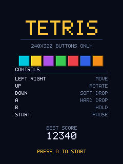
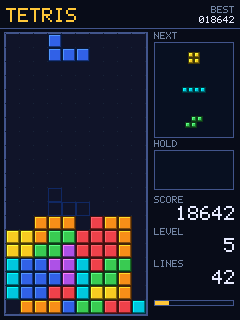
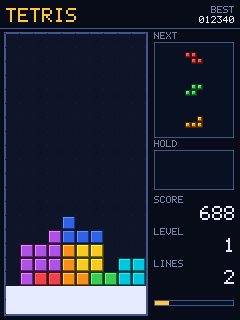
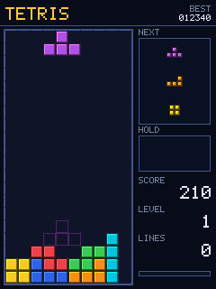
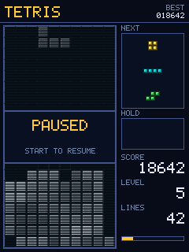
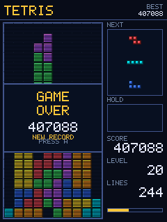

# TETRIS 240x320 — a game for a 240×320 screen with no touch

A game for a portrait 240×320 TFT (ILI9341 / ST7789 / ST7789V and friends),
driven by **physical buttons only**. Touch, mouse and pointer input are used
nowhere, not in the game and not in the simulator.

Tetris was picked because a portrait 240×320 panel is exactly the aspect ratio
of a 10×20 well: the field takes 140×280 px and leaves a full 80 px side panel
for NEXT, HOLD, score, level and lines. It also plays perfectly on five
buttons, with no diagonals and no aiming.

| Title | Gameplay | Line clear |
|---|---|---|
|  |  |  |

| Early game | Paused | Game over |
|---|---|---|
|  |  |  |

## What is in it

* **SRS** rotation with the full wall kick tables (separate ones for I).
* **7-bag** randomiser, so no runs of six S pieces.
* **Ghost piece** outline at the landing position.
* **HOLD**, once per piece.
* **Lock delay** of 500 ms with 15 resets, so a piece can still be adjusted
  after it touches down.
* **DAS/ARR** (170 / 45 ms): holding a direction slides smoothly, a tap moves
  exactly one cell.
* Soft and hard drop, combos, back-to-back tetris bonus, 20 speed levels.
* High score with a dirty flag so a port does not rewrite EEPROM every frame.

The core is plain C99: **no malloc, no float, no libc, no LVGL, no GUI_GSP**.
It knows nothing about the panel or the buttons.

## Controls

| Button | Action | Simulator key |
|---|---|---|
| LEFT / RIGHT | move | ← → |
| UP | rotate clockwise | ↑ |
| DOWN | soft drop | ↓ |
| A | hard drop, confirm | Space or Z |
| B | HOLD *(optional button)* | C or Left Shift |
| START | pause *(optional button)* | Enter or P |

**Five buttons** (LEFT, RIGHT, UP, DOWN, A) are enough to play the whole game;
only HOLD and pause are lost.

## Building the simulator

```bash
sudo apt install -y build-essential cmake pkg-config libsdl2-dev
cd TETRIS_GAME
cmake -S . -B build -DCMAKE_BUILD_TYPE=Release
cmake --build build -j
./build/tetris_sdl --scale 3     # 720x960 window, 240x320 image, no smoothing
./build/tetris_sdl --demo        # let the built-in bot play
```

The window is a pixel exact stand-in for the panel: the game renders into a
240×320 RGB565 buffer that is uploaded to an `SDL_PIXELFORMAT_RGB565` texture
unchanged. Escape quits.

Besides sampling the keyboard state once per frame, the simulator latches key
presses from the event queue: without that, a tap shorter than 16 ms would be
lost between two polls. The same applies on hardware if buttons are polled
infrequently.

## Tests

`tetris_shots` is a headless harness. It plays with the bot from `src/bot.c`
(stack evaluated by height, holes, bumpiness and completed lines), checks
invariants and writes PNG screenshots. It needs neither a display nor SDL, so
it runs in CI.

```bash
./build/tetris_shots build/shots
ctest --test-dir build
```

One of the checks is that **banded rendering produces exactly the same frame**
as full-frame rendering, which is what makes the low-RAM port below safe.

## Layout

```
TETRIS_GAME/
├── include/
│   ├── tetris.h      public game API
│   ├── gfx.h         RGB565 drawing primitives
│   └── font5x7.h     5x7 font
├── src/
│   ├── tetris.c      game logic and screen rendering
│   ├── gfx.c         pixels, rectangles, frames, text
│   ├── font5x7.c     glyphs 0x20..0x5F
│   └── bot.c         optional automatic player (tests and demo mode)
├── port/
│   └── main_sdl.c    desktop simulator, keyboard only
└── tools/
    ├── shots.c       bot, checks, screenshots
    └── png_write.c   PNG writer with no zlib dependency
```

## Porting to hardware

Three things are needed.

**1. Initialisation**

```c
tetris_init(seed, load_highscore_from_eeprom());
```

`seed` has to differ between runs or every game deals the same pieces. A free
running timer sampled at the first button press works, so does an ADC reading
from a floating pin.

**2. Buttons and the logic tick**

The mask is a level, not an edge: keep the bit set for as long as the button
is held. Edges, auto-repeat and timing are handled inside the game, so the
port only has to debounce.

```c
static uint32_t read_buttons(void)
{
    uint32_t b = 0;
    if (!HAL_GPIO_ReadPin(BTN_GPIO, PIN_LEFT))  b |= BTN_LEFT;   /* active low */
    if (!HAL_GPIO_ReadPin(BTN_GPIO, PIN_RIGHT)) b |= BTN_RIGHT;
    if (!HAL_GPIO_ReadPin(BTN_GPIO, PIN_UP))    b |= BTN_UP;
    if (!HAL_GPIO_ReadPin(BTN_GPIO, PIN_DOWN))  b |= BTN_DOWN;
    if (!HAL_GPIO_ReadPin(BTN_GPIO, PIN_A))     b |= BTN_A;
    return b;
}

/* a bit is accepted once N consecutive polls agree */
static uint32_t debounce(uint32_t raw)
{
    static uint32_t last, stable;
    static uint8_t  count;

    if (raw != last) { last = raw; count = 0; }
    else if (count < 3) { if (++count == 3) stable = raw; }
    return stable;
}
```

**3. The frame**

```c
static uint16_t line_buf[240 * 40];          /* 19 KB instead of 150 KB */
static gfx_t g = { line_buf, 240, 40, 0, 0 };

for (;;) {
    tetris_tick(millis(), debounce(read_buttons()));

    for (int y = 0; y < 320; y += 40) {
        g.y_off = y;
        tetris_render(&g);                   /* coordinates stay screen based */
        tft_blit(0, y, 240, 40, line_buf);   /* set the panel window, stream pixels */
    }

    if (tetris_take_highscore_dirty())
        save_highscore_to_eeprom(tetris_highscore());
}
```

The important part is `x_off` / `y_off` in `gfx_t`. The buffer may cover only a
band of the screen while all drawing code keeps working in screen coordinates
and everything outside is clipped away. A frame can therefore be assembled in
bands of any height: 40 rows is 19 KB, 8 rows is 3.8 KB, the whole screen is
150 KB. The harness verifies the banded result is byte identical.

Pixels are RGB565, the native format of ILI9341/ST7789 in 16-bit mode. If the
panel expects big-endian (most do), either enable the SPI/DMA byte swap or
swap the bytes inside `tft_blit`.

### Footprint

| | |
|---|---|
| Code (gcc `-Os`, x86-64) | ≈ 10 KB, noticeably less on Cortex-M; `bot.c` is not included and is not needed on a device |
| Game RAM | ≈ 0.6 KB static, no dynamic allocation |
| Frame buffer | 3.8 KB (8-row band) up to 150 KB (full screen) |
| Tick rate | `tetris_tick()` every ~16 ms; everything is timestamp driven, so a slower loop just looks less smooth |

The core avoids division in the hot path, floating point and recursion, so it
is comfortable on a Cortex-M0 or a PIC32.

### A different screen size

The layout is built from constants at the top of `src/tetris.c`: `CELL`,
`FIELD_X`, `FIELD_Y`, `PANEL_X`, `PANEL_W`. For 320×240 landscape, for
instance, drop `CELL` to 11 and move the panel.

### Tuning the feel

All at the top of `src/tetris.c`:

| Constant | Default | Meaning |
|---|---|---|
| `DAS_MS` | 170 | delay before horizontal auto-repeat |
| `ARR_MS` | 45 | auto-repeat interval |
| `SOFT_DROP_MS` | 45 | soft drop speed |
| `LOCK_DELAY_MS` | 500 | time to lock after touching down |
| `gravity_ms[]` | 800…35 | fall speed per level |

The gravity table is deliberately gentler than the guideline: 20G is not
playable on buttons.

## Relation to the rest of the repository

This project stands alone. `GUI_GSP` is a widget library for 1 bpp monochrome
128×64 displays and does not fit a colour Tetris. `DINO_GAME` is built on
LVGL 9 + SDL2 and expects touch. Neither is used here — just an own drawing
layer and buttons.

Русская версия: [README.md](README.md).
